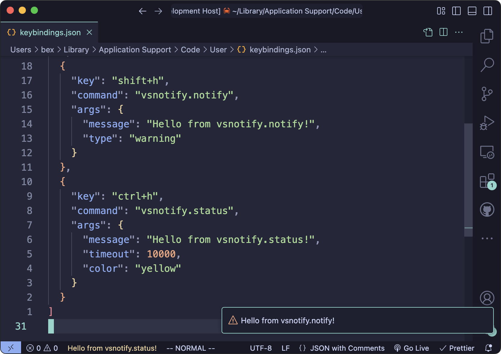

# vsnotify
Simple extension which allows you to send VS Code "notifications," either by message or status bar entry.

Check the <a href="https://bexli.dev/VSNotify">Documentation</a> for usage and examples for inspiration ⭐️

